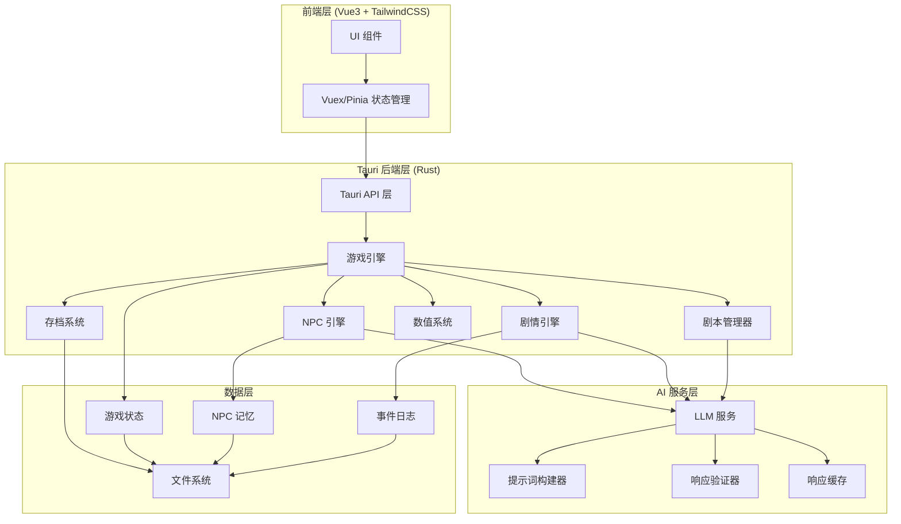

# 设计文档 - Nobody (修仙模拟器)

## 概述

Nobody 是一个基于 Tauri2 + Vue3 + TailwindCSS 的桌面应用程序，使用 LLM 驱动的 AI 技术创建沉浸式的文字修仙模拟体验。系统采用分层架构，将前端 UI、游戏逻辑、AI 服务和数据持久化清晰分离。

### 核心设计理念

1. **AI 约束框架**: LLM 的创造力被严格限制在修仙数值体系内，确保生成内容的一致性和可信度
2. **智能 NPC 自治**: 每个 NPC 拥有独立的 LLM 实例、记忆系统和决策引擎
3. **事件驱动架构**: 游戏通过事件系统协调 Player 行为、NPC 反应和剧情发展
4. **可序列化状态**: 所有游戏状态可完整序列化，支持保存/加载和小说生成

## 架构

### 系统架构图



### 技术栈

- **前端**: Vue3 (Composition API) + TailwindCSS + TypeScript
- **后端**: Tauri2 (Rust)
- **状态管理**: Pinia
- **AI 集成**: HTTP/REST API 调用 LLM 服务
- **数据存储**: JSON 文件 (本地文件系统)
- **版本控制**: Git (GitHub: https://github.com/MoSaSaPlus/Nobody)

## 组件和接口

### 1. 前端组件 (Vue3)

#### 1.1 主界面组件

```typescript
// MainMenu.vue - 主菜单
interface MainMenuProps {
  onNewGame: () => void;
  onLoadGame: () => void;
  onSettings: () => void;
}

// ScriptSelector.vue - 剧本选择器
interface ScriptSelectorProps {
  scriptTypes: ScriptType[];
  onScriptSelected: (script: Script) => void;
}

enum ScriptType {
  ExistingNovel = "existing_novel",
  RandomGenerated = "random_generated",
  Custom = "custom"
}

// GameView.vue - 游戏主视图
interface GameViewProps {
  plotText: string;
  isWaitingForInput: boolean;
  options: PlayerOption[];
  onPlayerAction: (action: PlayerAction) => void;
}

// NovelExporter.vue - 小说导出器
interface NovelExporterProps {
  gameHistory: GameEvent[];
  onExport: (novel: Novel) => void;
}
```

#### 1.2 状态管理 (Pinia)

```typescript
// stores/gameStore.ts
interface GameStore {
  // 状态
  currentScript: Script | null;
  playerCharacter: Character;
  npcs: Map<string, NPC>;
  currentPlot: PlotState;
  gameHistory: GameEvent[];
  
  // 操作
  initializeGame(script: Script): Promise<void>;
  executePlayerAction(action: PlayerAction): Promise<void>;
  saveGame(slotId: number): Promise<void>;
  loadGame(slotId: number): Promise<void>;
  generateNovel(): Promise<Novel>;
}
```

### 2. Tauri 后端组件 (Rust)

#### 2.1 游戏引擎

```rust
// game_engine.rs
pub struct GameEngine {
    script_manager: ScriptManager,
    npc_engine: NPCEngine,
    plot_engine: PlotEngine,
    numerical_system: NumericalSystem,
    save_load: SaveLoadSystem,
    event_bus: EventBus,
}

impl GameEngine {
    pub fn new() -> Self;
    pub async fn initialize_game(&mut self, script: Script) -> Result<GameState>;
    pub async fn process_player_action(&mut self, action: PlayerAction) -> Result<PlotUpdate>;
    pub fn get_current_state(&self) -> &GameState;
    pub async fn save_game(&self, slot_id: u32) -> Result<()>;
    pub async fn load_game(&mut self, slot_id: u32) -> Result<GameState>;
}
```

#### 2.2 剧本管理器

```rust
// script_manager.rs
pub struct ScriptManager {
    llm_service: Arc<LLMService>,
}

pub struct Script {
    pub id: String,
    pub name: String,
    pub script_type: ScriptType,
    pub world_setting: WorldSetting,
    pub initial_state: InitialState,
}

pub struct WorldSetting {
    pub cultivation_realms: Vec<CultivationRealm>,
    pub spiritual_roots: Vec<SpiritualRoot>,
    pub techniques: Vec<Technique>,
    pub locations: Vec<Location>,
    pub factions: Vec<Faction>,
}

impl ScriptManager {
    pub async fn load_existing_novel(&self, file_path: &str, character_name: &str) -> Result<Script>;
    pub async fn generate_random_script(&self) -> Result<Script>;
    pub fn load_custom_script(&self, file_path: &str) -> Result<Script>;
    pub fn validate_script(&self, script: &Script) -> Result<()>;
}
```

#### 2.3 数值系统

```rust
// numerical_system.rs
pub struct NumericalSystem {
    realm_rules: RealmRules,
    combat_calculator: CombatCalculator,
    lifespan_tracker: LifespanTracker,
}

pub struct CharacterStats {
    pub spiritual_root: SpiritualRoot,
    pub cultivation_realm: CultivationRealm,
    pub techniques: Vec<Technique>,
    pub lifespan: Lifespan,
    pub combat_power: u64,
}

pub struct SpiritualRoot {
    pub element: Element,
    pub grade: Grade, // 天灵根、地灵根等
    pub affinity: f32, // 0.0 - 1.0
}

pub struct CultivationRealm {
    pub name: String,
    pub level: u32,
    pub sub_level: u32, // 初期、中期、后期、大圆满
    pub power_multiplier: f32,
}

pub struct Lifespan {
    pub current_age: u32,
    pub max_age: u32,
    pub realm_bonus: u32,
}

impl NumericalSystem {
    pub fn calculate_action_result(&self, actor: &CharacterStats, action: &Action, context: &Context) -> ActionResult;
    pub fn validate_realm_breakthrough(&self, character: &CharacterStats, target_realm: &CultivationRealm) -> bool;
    pub fn calculate_combat_outcome(&self, attacker: &CharacterStats, defender: &CharacterStats) -> CombatResult;
    pub fn update_lifespan(&self, character: &mut CharacterStats, time_passed: u32);
}
```

#### 2.4 NPC 引擎

```rust
// npc_engine.rs
pub struct NPCEngine {
    npcs: HashMap<String, NPC>,
    llm_service: Arc<LLMService>,
    memory_manager: MemoryManager,
}

pub struct NPC {
    pub id: String,
    pub name: String,
    pub stats: CharacterStats,
    pub personality: Personality,
    pub memory: NPCMemory,
    pub relationships: HashMap<String, Relationship>,
}

pub struct Personality {
    pub traits: Vec<PersonalityTrait>,
    pub goals: Vec<Goal>,
    pub values: Vec<Value>,
}

pub struct NPCMemory {
    pub short_term: Vec<MemoryEntry>,
    pub long_term: Vec<MemoryEntry>,
    pub important_events: Vec<MemoryEntry>,
}

pub struct MemoryEntry {
    pub timestamp: u64,
    pub event: GameEvent,
    pub importance: f32,
    pub emotional_impact: f32,
}

pub struct Relationship {
    pub target_id: String,
    pub affinity: i32, // -100 到 100
    pub trust: i32,
    pub history: Vec<InteractionRecord>,
}

impl NPCEngine {
    pub async fn process_event(&mut self, event: &GameEvent) -> Result<Vec<NPCAction>>;
    pub async fn generate_npc_decision(&self, npc: &NPC, situation: &Situation) -> Result<NPCAction>;
    pub fn update_npc_memory(&mut self, npc_id: &str, event: &GameEvent);
    pub fn update_relationship(&mut self, npc_id: &str, target_id: &str, interaction: &Interaction);
    pub async fn autonomous_npc_actions(&mut self) -> Result<Vec<NPCAction>>;
}
```

#### 2.5 剧情引擎

```rust
// plot_engine.rs
pub struct PlotEngine {
    llm_service: Arc<LLMService>,
    numerical_system: Arc<NumericalSystem>,
    event_log: EventLog,
}

pub struct PlotState {
    pub current_scene: Scene,
    pub narrative_text: String,
    pub waiting_for_player: bool,
    pub available_options: Vec<PlayerOption>,
}

pub struct Scene {
    pub id: String,
    pub location: Location,
    pub participants: Vec<String>, // Character IDs
    pub context: SceneContext,
}

pub struct PlayerAction {
    pub action_type: ActionType,
    pub text_input: Option<String>,
    pub selected_option: Option<usize>,
}

pub enum ActionType {
    FreeText,
    SelectedOption,
}

pub struct PlayerOption {
    pub id: usize,
    pub description: String,
    pub requirements: Option<Requirements>,
}

impl PlotEngine {
    pub async fn generate_plot_text(&self, scene: &Scene, events: &[GameEvent]) -> Result<String>;
    pub async fn generate_player_options(&self, scene: &Scene) -> Result<Vec<PlayerOption>>;
    pub async fn process_player_action(&mut self, action: &PlayerAction) -> Result<PlotUpdate>;
    pub async fn validate_player_action(&self, action: &PlayerAction, scene: &Scene) -> Result<bool>;
    pub fn advance_plot(&mut self, outcome: &ActionResult) -> Result<PlotState>;
}

pub struct PlotUpdate {
    pub new_state: PlotState,
    pub triggered_events: Vec<GameEvent>,
    pub npc_reactions: Vec<NPCAction>,
}
```

#### 2.6 LLM 服务

```rust
// llm_service.rs
pub struct LLMService {
    api_config: LLMConfig,
    cache: ResponseCache,
    rate_limiter: RateLimiter,
}

pub struct LLMConfig {
    pub endpoint: String,
    pub api_key: String,
    pub model: String,
    pub max_tokens: u32,
    pub temperature: f32,
}

pub struct LLMRequest {
    pub prompt: String,
    pub constraints: Vec<Constraint>,
    pub context: Context,
    pub max_tokens: u32,
}

pub struct LLMResponse {
    pub text: String,
    pub metadata: ResponseMetadata,
}

pub struct Constraint {
    pub constraint_type: ConstraintType,
    pub parameters: serde_json::Value,
}

pub enum ConstraintType {
    NumericalSystem,
    CharacterPersonality,
    WorldRules,
    PlotCoherence,
}

impl LLMService {
    pub async fn generate(&self, request: LLMRequest) -> Result<LLMResponse>;
    pub async fn generate_with_retry(&self, request: LLMRequest, max_retries: u32) -> Result<LLMResponse>;
    pub fn build_prompt(&self, template: &str, context: &Context, constraints: &[Constraint]) -> String;
    pub fn validate_response(&self, response: &LLMResponse, constraints: &[Constraint]) -> Result<()>;
    pub fn cache_response(&mut self, request_hash: &str, response: &LLMResponse);
    pub fn get_cached_response(&self, request_hash: &str) -> Option<&LLMResponse>;
}
```

#### 2.7 存档系统

```rust
// save_load.rs
pub struct SaveLoadSystem {
    save_directory: PathBuf,
}

pub struct SaveData {
    pub version: String,
    pub timestamp: u64,
    pub game_state: GameState,
    pub player_character: Character,
    pub npcs: Vec<NPC>,
    pub plot_state: PlotState,
    pub event_history: Vec<GameEvent>,
}

impl SaveLoadSystem {
    pub fn save_game(&self, slot_id: u32, save_data: &SaveData) -> Result<()>;
    pub fn load_game(&self, slot_id: u32) -> Result<SaveData>;
    pub fn list_saves(&self) -> Result<Vec<SaveInfo>>;
    pub fn delete_save(&self, slot_id: u32) -> Result<()>;
    pub fn validate_save_data(&self, save_data: &SaveData) -> Result<()>;
}
```

#### 2.8 小说生成器

```rust
// novel_generator.rs
pub struct NovelGenerator {
    llm_service: Arc<LLMService>,
}

pub struct Novel {
    pub title: String,
    pub chapters: Vec<Chapter>,
    pub metadata: NovelMetadata,
}

pub struct Chapter {
    pub number: u32,
    pub title: String,
    pub content: String,
}

impl NovelGenerator {
    pub async fn generate_novel(&self, game_history: &[GameEvent], character: &Character) -> Result<Novel>;
    pub async fn generate_chapter(&self, events: &[GameEvent]) -> Result<Chapter>;
    pub fn export_to_file(&self, novel: &Novel, file_path: &str) -> Result<()>;
}
```

### 3. Tauri API 接口

```rust
// tauri_commands.rs
#[tauri::command]
async fn initialize_game(script: Script) -> Result<GameState, String>;

#[tauri::command]
async fn execute_player_action(action: PlayerAction) -> Result<PlotUpdate, String>;

#[tauri::command]
async fn get_game_state() -> Result<GameState, String>;

#[tauri::command]
async fn save_game(slot_id: u32) -> Result<(), String>;

#[tauri::command]
async fn load_game(slot_id: u32) -> Result<GameState, String>;

#[tauri::command]
async fn generate_novel() -> Result<Novel, String>;

#[tauri::command]
async fn load_script(script_type: ScriptType, params: ScriptParams) -> Result<Script, String>;

#[tauri::command]
async fn get_player_options() -> Result<Vec<PlayerOption>, String>;
```

## 数据模型

### 核心数据结构

```rust
// models.rs

// 游戏状态
pub struct GameState {
    pub script: Script,
    pub player: Character,
    pub npcs: HashMap<String, NPC>,
    pub plot_state: PlotState,
    pub world_state: WorldState,
    pub game_time: GameTime,
}

// 角色
pub struct Character {
    pub id: String,
    pub name: String,
    pub stats: CharacterStats,
    pub inventory: Vec<Item>,
    pub location: String,
}

// 世界状态
pub struct WorldState {
    pub locations: HashMap<String, Location>,
    pub factions: HashMap<String, Faction>,
    pub global_events: Vec<GlobalEvent>,
}

// 游戏时间
pub struct GameTime {
    pub year: u32,
    pub month: u32,
    pub day: u32,
    pub total_days: u32,
}

// 游戏事件
pub struct GameEvent {
    pub id: String,
    pub timestamp: u64,
    pub event_type: EventType,
    pub participants: Vec<String>,
    pub description: String,
    pub consequences: Vec<Consequence>,
}

pub enum EventType {
    PlayerAction,
    NPCAction,
    Combat,
    Breakthrough,
    Death,
    Relationship,
    Discovery,
    Quest,
}

// 行动结果
pub struct ActionResult {
    pub success: bool,
    pub description: String,
    pub stat_changes: Vec<StatChange>,
    pub triggered_events: Vec<GameEvent>,
}

// 战斗结果
pub struct CombatResult {
    pub winner: String,
    pub loser: String,
    pub damage_dealt: u32,
    pub consequences: Vec<Consequence>,
}
```

### 数据持久化格式

所有游戏数据使用 JSON 格式序列化：

```json
{
  "version": "1.0.0",
  "timestamp": 1234567890,
  "game_state": {
    "script": { "..." },
    "player": { "..." },
    "npcs": { "..." },
    "plot_state": { "..." },
    "world_state": { "..." },
    "game_time": { "..." }
  },
  "event_history": [ "..." ]
}
```

## 正确性属性

*属性是一个特征或行为，应该在系统的所有有效执行中保持为真――本质上是关于系统应该做什么的形式化陈述。属性作为人类可读规范和机器可验证正确性保证之间的桥梁。*


### 属性反思

在编写正确性属性之前，我对预分析中识别的可测试属性进行了反思，以消除冗余：

**识别的冗余和合并**:
1. 需求 2.2 和 10.7 都测试"LLM 生成内容符合数值系统约束" - 合并为一个属性
2. 需求 2.4 和 5.7 都测试"基于数值系统计算行动结果" - 合并为一个属性
3. 需求 9.3 和 9.4 可以合并为一个往返属性"保存然后加载恢复原状态"
4. 需求 1.6 和 1.7 可以合并为一个属性"剧本验证"
5. 需求 4.6 实际上是 2.2 的子集（NPC 决策也是 LLM 生成内容）- 不需要单独属性

**保留的独特属性**:
- 每个属性提供独特的验证价值
- 避免了逻辑上的包含关系
- 确保测试覆盖不重叠

### 正确性属性列表

**属性 1: 剧本类型支持完整性**
*对于任何*剧本类型（现有小说、随机生成、自定义），系统都应该能够成功加载并初始化游戏状态
**验证需求: 1.2**

**属性 2: 随机剧本生成完整性**
*对于任何*随机剧本生成请求，系统都应该返回包含修仙境界、灵根、功法、地点、门派等必要元素的完整世界设定
**验证需求: 1.4**

**属性 3: 剧本验证一致性**
*对于任何*剧本，如果缺少必要的世界设定或数值系统参数，系统应该拒绝加载并返回描述性错误信息
**验证需求: 1.6, 1.7**

**属性 4: LLM 输出数值约束**
*对于任何*LLM 生成的游戏内容（剧情、NPC 行为、事件结果），系统都应该验证其符合当前数值系统的规则（境界限制、寿元限制、战力计算等）
**验证需求: 2.2, 10.7**

**属性 5: 行动结果数值一致性**
*对于任何*角色行动（玩家或 NPC），系统计算的结果应该严格基于数值系统规则，相同的输入状态和行动应该产生相同的结果
**验证需求: 2.4, 5.7**

**属性 6: 境界提升属性更新**
*对于任何*角色的境界提升，系统应该更新所有相关数值属性（战力、寿元上限、可用功法等），并且新属性值应该符合新境界的规则
**验证需求: 2.5**

**属性 7: 寿元耗尽触发死亡**
*对于任何*角色，当其当前年龄达到或超过最大寿元时，系统应该触发死亡事件并更新游戏状态
**验证需求: 2.6**

**属性 8: 数值冲突解决确定性**
*对于任何*产生数值冲突的情况（如多个效果同时影响同一属性），系统应该使用预定义的优先级规则解决，相同的冲突应该产生相同的解决结果
**验证需求: 2.7**

**属性 9: 事件记录完整性**
*对于任何*重要游戏事件（战斗、突破、死亡、重要对话等），系统都应该将其记录到事件历史中，记录应包含时间戳、参与者、描述和后果
**验证需求: 3.1**

**属性 10: 小说生成可用性**
*对于任何*包含至少一个事件的游戏历史，系统都应该能够生成包含章节结构的完整小说
**验证需求: 3.3, 3.4**

**属性 11: 小说导出功能**
*对于任何*生成的小说，系统都应该能够将其导出为文本文件，导出的文件应该包含完整的小说内容
**验证需求: 3.5**

**属性 12: 小说事件时序保持**
*对于任何*生成的小说，其中的事件应该按照游戏历史中的时间戳顺序排列，不应该出现时间倒流或因果倒置
**验证需求: 3.6**

**属性 13: NPC 事件响应生成**
*对于任何*影响 NPC 的游戏事件，系统都应该为该 NPC 生成基于其性格和记忆的行为决策
**验证需求: 4.3**

**属性 14: 互动更新关系**
*对于任何*NPC 与玩家或其他 NPC 的互动，系统都应该更新相关的人际关系数据（好感度、信任度、互动历史）
**验证需求: 4.4**

**属性 15: NPC 自主行动能力**
*对于任何*游戏回合，即使玩家未执行任何操作，系统也应该允许 NPC 根据其目标和环境自主发起行动
**验证需求: 4.5**

**属性 16: NPC 记忆持久化**
*对于任何*NPC 经历的重要事件，系统都应该将其添加到该 NPC 的记忆系统中，记忆应包含事件内容、重要性和情感影响
**验证需求: 4.7**

**属性 17: NPC 记忆压缩保真**
*对于任何*NPC，当其记忆条目超过存储限制时，系统应该使用重要性算法压缩或归档低重要性记忆，而不是简单删除，确保关键信息不丢失
**验证需求: 4.8**

**属性 18: 剧情决策点暂停**
*对于任何*需要玩家决策的剧情点，系统都应该暂停剧情推进并等待玩家输入，不应该自动跳过或替玩家做决定
**验证需求: 5.2**

**属性 19: 选项数量约束**
*对于任何*系统生成的玩家选项列表，选项数量应该在 2 到 5 个之间（包含边界）
**验证需求: 5.4**

**属性 20: 自由文本意图解析**
*对于任何*玩家输入的自由文本，系统都应该使用 LLM 解析出玩家的行动意图，并将其转换为游戏内的具体行动
**验证需求: 5.5**

**属性 21: 不合理行为拒绝**
*对于任何*不符合当前场景、角色能力或世界规则的玩家输入，系统都应该拒绝该行为并提示玩家重新输入
**验证需求: 5.6**

**属性 22: 剧情发展触发 NPC 反应**
*对于任何*剧情发展事件，系统都应该识别所有相关 NPC 并为每个 NPC 生成相应的反应或行为
**验证需求: 5.8**

**属性 23: 窗口调整布局保持**
*对于任何*窗口大小调整操作，UI 布局应该保持合理和可用，不应该出现元素重叠、文本截断或功能不可访问
**验证需求: 8.6**

**属性 24: 游戏状态保存能力**
*对于任何*有效的游戏状态，系统都应该能够将其完整保存到本地文件，保存操作应该成功完成
**验证需求: 9.1**

**属性 25: 存档加载能力**
*对于任何*有效的存档文件，系统都应该能够成功加载并恢复游戏状态
**验证需求: 9.2**

**属性 26: 保存加载往返一致性**
*对于任何*游戏状态，执行保存然后立即加载操作后，恢复的游戏状态应该与原始状态等价（所有角色属性、NPC 状态、剧情进度、事件历史都相同）
**验证需求: 9.3, 9.4**

**属性 27: 存档验证保护**
*对于任何*存档文件，系统在加载前都应该验证其完整性和版本兼容性，对于损坏或不兼容的存档应该拒绝加载并返回错误信息
**验证需求: 9.5, 9.6**

**属性 28: 多存档槽位隔离**
*对于任何*两个不同的存档槽位，保存到一个槽位的数据不应该影响另一个槽位的数据，每个槽位应该维护独立的游戏状态
**验证需求: 9.7**

**属性 29: LLM 提示词上下文完整性**
*对于任何*LLM 调用，构造的提示词都应该包含必要的上下文信息（当前场景、角色状态、历史事件）和约束条件（数值系统规则、世界设定）
**验证需求: 10.2**

**属性 30: LLM 调用失败容错**
*对于任何*LLM API 调用失败或超时，系统都应该优雅处理（记录错误、通知用户、使用后备方案），不应该导致应用崩溃
**验证需求: 10.3**

**属性 31: LLM 响应验证重试**
*对于任何*无效或不符合格式的 LLM 响应，系统都应该尝试重试（最多 N 次）或使用预定义的后备方案，确保游戏能够继续
**验证需求: 10.4**

**属性 32: LLM 响应缓存命中**
*对于任何*相同的 LLM 请求（相同的提示词和参数），系统应该返回缓存的响应而不是重新调用 API，以提高性能和降低成本
**验证需求: 10.5**

**属性 33: LLM Token 限制遵守**
*对于任何*LLM 调用，请求的 token 数量都应该不超过配置的最大限制，系统应该在构造提示词时确保这一点
**验证需求: 10.6**

## 错误处理

### 错误类型和处理策略

#### 1. LLM 服务错误

**错误场景**:
- API 调用失败（网络错误、服务不可用）
- API 超时
- 响应格式无效
- 响应内容不符合约束

**处理策略**:
```rust
pub enum LLMError {
    NetworkError(String),
    Timeout,
    InvalidResponse(String),
    ConstraintViolation(String),
}

impl LLMService {
    async fn generate_with_fallback(&self, request: LLMRequest) -> Result<LLMResponse> {
        let mut retries = 0;
        let max_retries = 3;
        
        while retries < max_retries {
            match self.generate(request.clone()).await {
                Ok(response) => {
                    if self.validate_response(&response, &request.constraints).is_ok() {
                        return Ok(response);
                    }
                    retries += 1;
                }
                Err(e) => {
                    log::error!("LLM call failed: {:?}", e);
                    retries += 1;
                    tokio::time::sleep(Duration::from_secs(2_u64.pow(retries))).await;
                }
            }
        }
        
        // 使用后备方案
        self.use_fallback_response(&request)
    }
}
```

#### 2. 数据验证错误

**错误场景**:
- 剧本文件格式无效
- 存档文件损坏
- 数值系统约束违反

**处理策略**:
```rust
pub enum ValidationError {
    InvalidFormat(String),
    MissingRequiredField(String),
    ConstraintViolation(String),
    VersionMismatch { expected: String, found: String },
}

impl Validator {
    fn validate_with_details<T: Validate>(&self, data: &T) -> Result<(), ValidationError> {
        data.validate()?;
        Ok(())
    }
    
    fn provide_user_feedback(&self, error: &ValidationError) -> String {
        match error {
            ValidationError::InvalidFormat(msg) => {
                format!("文件格式无效: {}", msg)
            }
            ValidationError::MissingRequiredField(field) => {
                format!("缺少必要字段: {}", field)
            }
            ValidationError::ConstraintViolation(msg) => {
                format!("数值约束违反: {}", msg)
            }
            ValidationError::VersionMismatch { expected, found } => {
                format!("版本不兼容: 期望 {}, 实际 {}", expected, found)
            }
        }
    }
}
```

#### 3. 游戏逻辑错误

**错误场景**:
- 玩家输入不合理行为
- NPC 决策违反规则
- 状态转换无效

**处理策略**:
```rust
pub enum GameLogicError {
    InvalidAction(String),
    StateTransitionError(String),
    NPCDecisionError(String),
}

impl GameEngine {
    fn handle_invalid_action(&mut self, error: GameLogicError) -> PlotUpdate {
        match error {
            GameLogicError::InvalidAction(reason) => {
                PlotUpdate {
                    new_state: self.get_current_state().clone(),
                    triggered_events: vec![],
                    npc_reactions: vec![],
                    user_message: Some(format!(
                        "该行为不可执行: {}。请重新选择行动。", 
                        reason
                    )),
                }
            }
            _ => self.create_error_plot_update(error),
        }
    }
}
```

#### 4. 文件系统错误

**错误场景**:
- 文件读写失败
- 磁盘空间不足
- 权限不足

**处理策略**:
```rust
pub enum FileSystemError {
    ReadError(std::io::Error),
    WriteError(std::io::Error),
    PermissionDenied,
    DiskFull,
}

impl SaveLoadSystem {
    fn handle_save_error(&self, error: FileSystemError) -> Result<()> {
        match error {
            FileSystemError::DiskFull => {
                Err(anyhow::anyhow!("磁盘空间不足，无法保存游戏"))
            }
            FileSystemError::PermissionDenied => {
                Err(anyhow::anyhow!("没有写入权限，请检查文件夹权限"))
            }
            _ => Err(anyhow::anyhow!("保存失败: {:?}", error)),
        }
    }
}
```

### 错误恢复机制

1. **自动重试**: LLM 调用失败时自动重试，使用指数退避策略
2. **后备方案**: 当 LLM 不可用时，使用预定义的响应模板
3. **状态回滚**: 当操作失败时，回滚到上一个有效状态
4. **用户通知**: 所有错误都应该以用户友好的方式呈现
5. **日志记录**: 所有错误都应该记录到日志文件，便于调试

## 测试策略

### 测试方法

本项目采用**双重测试方法**，结合单元测试和基于属性的测试：

- **单元测试**: 验证特定示例、边缘情况和错误条件
- **属性测试**: 验证跨所有输入的通用属性

两者是互补的，对于全面覆盖都是必要的。单元测试捕获具体的 bug，属性测试验证一般正确性。

### 单元测试策略

单元测试应该专注于：
- **特定示例**: 演示正确行为的具体案例
- **集成点**: 组件之间的交互
- **边缘情况**: 边界条件和特殊情况
- **错误条件**: 错误处理和异常情况

**避免编写过多的单元测试** - 基于属性的测试已经处理了大量输入的覆盖。

### 基于属性的测试配置

**测试库选择**:
- **Rust 后端**: 使用 `proptest` 库
- **TypeScript 前端**: 使用 `fast-check` 库

**配置要求**:
- 每个属性测试最少运行 **100 次迭代**（由于随机化）
- 每个属性测试必须引用其设计文档中的属性
- 标签格式: **Feature: Nobody, Property {number}: {property_text}**
- 每个正确性属性必须由**单个**基于属性的测试实现

### 测试示例

#### Rust 属性测试示例

```rust
use proptest::prelude::*;

// Feature: Nobody, Property 26: 保存加载往返一致性
// 对于任何游戏状态，执行保存然后立即加载操作后，
// 恢复的游戏状态应该与原始状态等价
#[test]
fn test_save_load_roundtrip() {
    proptest!(|(game_state in arb_game_state())| {
        let save_system = SaveLoadSystem::new();
        let slot_id = 1;
        
        // 保存游戏状态
        let save_data = SaveData::from_game_state(&game_state);
        save_system.save_game(slot_id, &save_data).unwrap();
        
        // 加载游戏状态
        let loaded_data = save_system.load_game(slot_id).unwrap();
        let loaded_state = loaded_data.game_state;
        
        // 验证状态等价
        prop_assert_eq!(game_state, loaded_state);
    });
}

// 生成任意游戏状态的策略
fn arb_game_state() -> impl Strategy<Value = GameState> {
    (
        arb_script(),
        arb_character(),
        prop::collection::hash_map(any::<String>(), arb_npc(), 0..10),
        arb_plot_state(),
        arb_world_state(),
        arb_game_time(),
    ).prop_map(|(script, player, npcs, plot_state, world_state, game_time)| {
        GameState {
            script,
            player,
            npcs,
            plot_state,
            world_state,
            game_time,
        }
    })
}
```

#### TypeScript 属性测试示例

```typescript
import fc from 'fast-check';
import { describe, it, expect } from 'vitest';

// Feature: Nobody, Property 19: 选项数量约束
// 对于任何系统生成的玩家选项列表，
// 选项数量应该在 2 到 5 个之间（包含边界）
describe('PlotEngine', () => {
  it('should generate 2-5 options for any scene', () => {
    fc.assert(
      fc.asyncProperty(
        arbScene(),
        async (scene) => {
          const plotEngine = new PlotEngine();
          const options = await plotEngine.generatePlayerOptions(scene);
          
          expect(options.length).toBeGreaterThanOrEqual(2);
          expect(options.length).toBeLessThanOrEqual(5);
        }
      ),
      { numRuns: 100 }
    );
  });
});

// 生成任意场景的策略
function arbScene(): fc.Arbitrary<Scene> {
  return fc.record({
    id: fc.uuid(),
    location: arbLocation(),
    participants: fc.array(fc.uuid(), { minLength: 1, maxLength: 5 }),
    context: arbSceneContext(),
  });
}
```

#### 单元测试示例

```rust
#[cfg(test)]
mod tests {
    use super::*;

    // 测试特定示例：玩家启动新游戏时显示剧本选择界面
    #[test]
    fn test_new_game_shows_script_selector() {
        let app = App::new();
        let state = app.start_new_game();
        
        assert!(state.ui_state.script_selector_visible);
        assert_eq!(state.ui_state.available_script_types.len(), 3);
    }

    // 测试边缘情况：空的游戏历史生成小说
    #[test]
    fn test_generate_novel_with_empty_history() {
        let generator = NovelGenerator::new();
        let empty_history = vec![];
        let character = create_test_character();
        
        let result = generator.generate_novel(&empty_history, &character).await;
        
        assert!(result.is_err());
        assert!(result.unwrap_err().to_string().contains("历史记录为空"));
    }

    // 测试错误条件：加载损坏的存档文件
    #[test]
    fn test_load_corrupted_save_file() {
        let save_system = SaveLoadSystem::new();
        let corrupted_file = "corrupted_save.json";
        
        let result = save_system.load_game_from_file(corrupted_file);
        
        assert!(result.is_err());
        assert!(matches!(result.unwrap_err(), ValidationError::InvalidFormat(_)));
    }
}
```

### 测试覆盖目标

- **核心游戏逻辑**: 90%+ 代码覆盖率
- **数值系统**: 100% 代码覆盖率（关键系统）
- **LLM 集成**: 80%+ 代码覆盖率（模拟 LLM 响应）
- **UI 组件**: 70%+ 代码覆盖率（使用 Vue Test Utils）

### 持续集成

所有测试应该在 CI/CD 流程中自动运行：
- 每次提交时运行单元测试
- 每次 PR 时运行完整测试套件（包括属性测试）
- 测试失败时阻止合并

## Git 版本管理策略

### 仓库信息

- **仓库地址**: https://github.com/MoSaSaPlus/Nobody
- **主分支**: `main`
- **开发分支**: `develop`

### 分支策略

采用 **Git Flow** 工作流：

```
main (生产就绪代码)
  ↑
develop (开发主线)
  ↑
feature/* (功能分支)
  ↑
hotfix/* (紧急修复)
```

**分支命名规范**:
- 功能分支: `feature/script-system`, `feature/npc-engine`
- 修复分支: `bugfix/save-load-error`
- 紧急修复: `hotfix/llm-timeout`

### 提交信息规范

使用 **Conventional Commits** 格式：

```
<type>(<scope>): <subject>

<body>

<footer>
```

**类型 (type)**:
- `feat`: 新功能
- `fix`: Bug 修复
- `docs`: 文档更新
- `style`: 代码格式调整
- `refactor`: 代码重构
- `test`: 测试相关
- `chore`: 构建/工具相关

**示例**:
```
feat(script): implement random script generation

- Add LLM-based world setting generator
- Implement cultivation realm generation
- Add script validation logic

Closes #123
```

### 提交时机

在以下情况下创建 Git 提交：
1. 完成一个完整的功能模块
2. 完成一组相关的测试
3. 修复一个 bug
4. 完成代码重构
5. 每个主要开发阶段结束时

### 代码审查

- 所有功能分支必须通过 PR 合并到 `develop`
- PR 必须至少有一个审查者批准
- PR 必须通过所有 CI 测试
- PR 应该包含相关的测试代码

### 版本标签

使用语义化版本号 (Semantic Versioning):
- `v0.1.0`: 初始原型
- `v0.2.0`: 核心功能完成
- `v1.0.0`: 正式发布版本

## 实现注意事项

### 性能优化

1. **LLM 调用优化**:
   - 实现请求缓存，避免重复调用
   - 使用批处理减少 API 调用次数
   - 实现请求队列和速率限制

2. **内存管理**:
   - NPC 记忆使用分层存储（短期/长期）
   - 事件历史定期归档
   - 大型数据结构使用引用计数

3. **UI 响应性**:
   - LLM 调用使用异步处理
   - 长时间操作显示进度指示器
   - 使用虚拟滚动处理长文本

### 安全考虑

1. **LLM API 密钥**: 使用环境变量或加密配置文件存储
2. **用户数据**: 所有存档文件存储在用户本地，不上传到服务器
3. **输入验证**: 所有用户输入都应该经过验证和清理
4. **Mod 安全**: 未来实现 Mod 时需要沙箱隔离

### 可扩展性

1. **插件架构**: 为未来的 Mod 系统预留接口
2. **配置驱动**: 数值系统参数应该可配置
3. **多语言支持**: UI 文本使用 i18n 框架
4. **主题系统**: UI 样式应该可定制

### 开发优先级

**第一阶段 (MVP)**:
1. 基础框架搭建（Tauri + Vue）
2. 数值系统实现
3. 简单的剧本加载（自定义剧本）
4. 基础剧情引擎（选项式交互）
5. 存档系统

**第二阶段**:
1. LLM 集成
2. 智能 NPC 系统
3. 随机剧本生成
4. 自由文本输入

**第三阶段**:
1. 小说生成功能
2. 现有小说剧本导入
3. UI 优化和美化
4. 性能优化

**未来阶段**:
1. Mod 支持
2. 多人联机（可选）
3. 云存档同步（可选）
